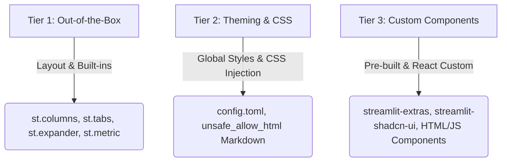

# Streamlit UI Customization: From Basic to Advanced

Streamlit is built for rapid application prototyping, but it is **not** limited to basic layouts. You can range from simple out-of-the-box styling to premium, highly customized, and custom-interactive user interfaces.

Here is a comprehensive breakdown of the customization scope in Streamlit, categorized by complexity.

---

## 1. Customization Tiers



---

## 2. Tier Breakdown & Advanced Customization Techniques

### 📂 Tier 1: Layout & Core Widgets (Basic to Intermediate)
Streamlit provides layout containers that can structure your app dynamically:
*   **Columns (`st.columns`)**: Control alignment and width ratios (e.g., `st.columns([1.5, 2, 2.5])`).
*   **Tabs (`st.tabs`)**: Keep content organized without overwhelming a single view.
*   **Expanders (`st.expander`)**: Hide secondary details (like raw texts or long logs).
*   **Containers (`st.container`)**: Group elements together so you can apply styling or order them dynamically.
*   **Status Elements (`st.status`, `st.spinner`)**: Display asynchronous background tasks nicely.

---

### 🎨 Tier 2: Custom CSS Injection & Theming (Advanced)
Streamlit supports injecting custom CSS directly into your app. This is the easiest way to give your app a premium, custom-branded feel (e.g., glassmorphism, custom fonts, rounded buttons, card layouts).

#### A. Global Theming via `.streamlit/config.toml`
Create a `.streamlit/config.toml` file in your project directory to set global primary colors, background colors, and fonts:
```toml
[theme]
primaryColor = "#6366f1"     # Indigo accent color
backgroundColor = "#0f172a"  # Dark Slate background
secondaryBackgroundColor = "#1e293b" # Slightly lighter Slate for containers
textColor = "#f8fafc"        # Off-white text
font = "sans serif"
```

#### B. Direct CSS Injection
You can target Streamlit elements (such as blocks, buttons, and headers) by injecting custom `<style>` blocks using `st.markdown(..., unsafe_allow_html=True)`.

**Example: Creating Premium Cards with Hover Effects**
```python
import streamlit as st

# Inject custom CSS
st.markdown("""
    <style>
    /* Styling for a custom card */
    .metric-card {
        background: rgba(255, 255, 255, 0.03);
        backdrop-filter: blur(10px);
        border: 1px solid rgba(255, 255, 255, 0.1);
        border-radius: 12px;
        padding: 20px;
        transition: transform 0.2s ease, border-color 0.2s ease;
        margin-bottom: 15px;
    }
    .metric-card:hover {
        transform: translateY(-2px);
        border-color: #6366f1; /* Accent color */
        box-shadow: 0 4px 20px rgba(99, 102, 241, 0.15);
    }
    .metric-title {
        color: #94a3b8;
        font-size: 0.85rem;
        font-weight: 600;
        text-transform: uppercase;
        margin-bottom: 5px;
    }
    .metric-value {
        color: #f8fafc;
        font-size: 1.5rem;
        font-weight: 700;
    }
    </style>
""", unsafe_allow_html=True)

# Usage in app:
st.markdown("""
    <div class="metric-card">
        <div class="metric-title">✉️ Email Address</div>
        <div class="metric-value">johndoe@email.com</div>
    </div>
""", unsafe_allow_html=True)
```

---

### 🔌 Tier 3: Advanced Ecosystem & Custom React Components (Expert)
If standard components and CSS are not enough, you can extend Streamlit using third-party packages or by building your own HTML/React components.

#### A. Popular Third-Party Packages
*   `streamlit-extras`: Provides interactive badges, styled cards, vertical line gaps, and micro-interactions.
*   `streamlit-option-menu`: Provides horizontal/vertical navigation bars that feel native.
*   `streamlit-shadcn-ui`: Implements beautiful, modern Shadcn component styles inside Streamlit.
*   `streamlit-lottie`: Renders lightweight, scalable vector animations (Lottie JSON) for premium loading states and celebrations.

#### B. Streamlit HTML/JS Components (`streamlit.components.v1`)
You can compile and render entire custom HTML pages, interactive iframes, or custom React/TypeScript frontend web applications directly inside a Streamlit container and exchange bidirectional data between Python and JS.

```python
import streamlit.components.v1 as components

# Render custom HTML and JavaScript directly
components.html("""
    <div style="background-color: #1e1b4b; padding: 10px; border-radius: 8px;">
        <h3 style="color: #818cf8; font-family: sans-serif;">Interactive Widget</h3>
        <button onclick="alert('Hello from HTML/JS!')" style="background-color: #6366f1; color: white; border: none; padding: 8px 16px; border-radius: 4px; cursor: pointer;">
            Click Me
        </button>
    </div>
""", height=120)
```

---

## 3. Summary of Recommendations for Your Resume Parser
For your **AI Resume Parser**, here are the best ways to elevate the UI to look premium:
1.  **Introduce custom CSS Cards** to replace default `st.metric` (which can look a bit clinical).
2.  **Add animations/Lottie** instead of standard loading spinners to make processing feel fast and premium.
3.  **Implement a grid system** using `st.columns` and custom borders to separate personal details, skills, and work experience nicely.
4.  **Use custom sidebar navigation** or a clean tab system (`st.tabs`) to toggle between "Candidate Insights", "Raw Extracted Text", and "JSON Schema Export".
